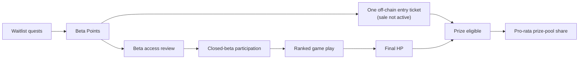
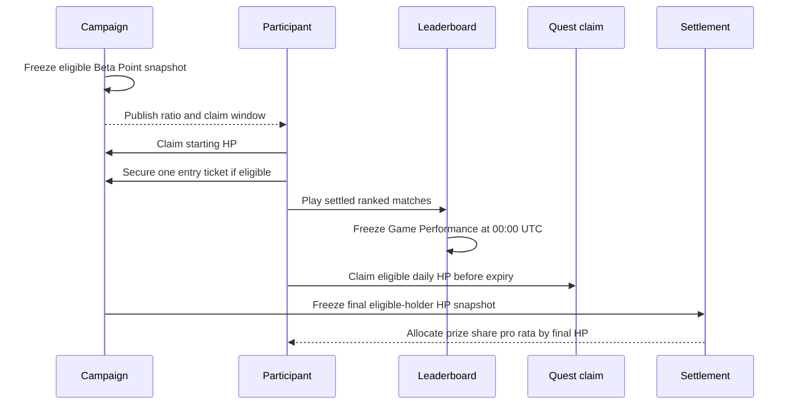

# Closed Beta Economics

This page separates the public campaign rule, the system already implemented,
and the recommended launch calibration. Values marked **proposal** are not live
until the live campaign response and official announcement publish them.

## Status at 31 July 2026

| Area | Current status |
|---|---|
| Waitlist quests and Beta Points | Live; the current waitlist closes at **00:00 UTC on 1 August 2026** |
| HP and Game Performance leaderboards | Implemented; both include ticket and non-ticket participants in one ranking |
| Public game-weight formula and live weight disclosure | Implemented |
| Off-chain prize-pool entry ticket | Implemented, but no production sale or ticket is active |
| Beta Point-to-HP conversion | Mechanism implemented; no production ratio or claim window is active |
| Daily Game Performance rank claim | Implemented behind a disabled production flag |
| Final real-value prize settlement | Parameters and settlement schedule are not active |

HP and Beta Points remain off-chain campaign scores. The entry ticket is also an
off-chain eligibility record today; it is not an NFT.

## The Fixed Prize-Pool Rule

The closed-beta prize pool is reserved for eligible entry-ticket holders and is
split in proportion to their final HP:

```text
holder payout = total prize pool × holder final HP / sum of all eligible holders' final HP
```

Ticket and non-ticket participants still share the same public rankings. A
ticket affects prize eligibility and rank-reward claim eligibility only; it does
not increase HP, Game Performance score, or rank.



## Why Waitlist Contribution Still Matters

Waitlist participants contributed attention, testing, referrals, community
activity, and early feedback before the arena opened. A 1:1 starting conversion
would preserve that history in a simple, auditable way:

```text
starting HP = frozen eligible Beta Points × 1.0
```

That ratio is the **recommended proposal**, not an active production parameter.
The snapshot, eligibility rule, conversion ratio, and claim window must all be
published before any claim opens.

A direct starting balance alone is not enough: if mission claims dominate all
new HP, gameplay becomes economically optional. Closed beta therefore needs a
controlled new-emission budget that gives repeatable advantage to demonstrated
game performance without erasing early contribution.

## Recommended Emission Envelope

Let **H0** be the total starting HP credited to eligible closed-beta entrants at
the conversion snapshot. The recommended closed-beta target is to keep new HP
issuance at or below **50% of H0** for the measured beta phase:

| Source | Recommended cap as share of H0 | Purpose |
|---|---:|---|
| Daily Game Performance rank claims | 15% | Reward repeated competitive results |
| Game-specific Arena Passport quests | 25% | Make every supported game worth learning |
| First-match / entry-fee support | 5% | Reduce the cost of trying a new game |
| Non-game daily and social quests | 5% | Retain light engagement without dominating play |
| **Total new HP** | **50%** | Preserve waitlist history while creating a game-driven path upward |

This is a portfolio limit, not a guarantee that the entire allowance will be
issued. Unclaimed rewards remain unissued.

## Recommended Daily Rank Calibration

The existing pre-launch engineering defaults are 2,000 / 1,500 / 1,000 HP for
Top 10 / Top 30 / Top 50. Under a 1:1 migration, those values would let a short
sequence of claims overwhelm a large part of the waitlist history. The
recommended launch values are therefore:

| Frozen overall Game Performance rank | Recommended daily claim |
|---|---:|
| 1–10 | 400 HP |
| 11–30 | 200 HP |
| 31–50 | 100 HP |

Recommended launch rules:

- use a rolling **7-day** performance window rather than cumulative all-time
  results;
- require at least one settled ranked match during the reward day;
- freeze the result at 00:00 UTC using the exact published weight profile;
- allow **72 hours** to claim, after which the reward expires;
- rank ticket and non-ticket users together, with no roll-down when an
  ineligible user occupies a rewarded position.

These rules are a **proposal**. The current implementation freezes the
cumulative performance standings and must be updated before this calibration is
activated.

## Recommended Game Quest Calibration

Game-specific quest rewards should follow the same effort evidence as the Game
Performance board and round to the nearest ten HP. A practical launch vector is:

| Game | Recommended one-time Passport reward |
|---|---:|
| Liar's Dice | 30 HP |
| Mafia | 40 HP |
| Claw Vegas | 110 HP |
| Diplomacy | 120 HP |
| Clawpoly | 200 HP |

These values compensate for duration, model-token cost, and completion burden
without letting one long match decide the entire economy. Live weights can
change as the rolling evidence changes; any quest reward change should be
published before it applies and should stay rounded to tens for readability.

## Balance From Four Viewpoints

| Viewpoint | What can go wrong | Recommended protection |
|---|---|---|
| Early waitlist contributor | Starting work is diluted immediately | Preserve the frozen record with a simple 1:1 starting-HP proposal |
| Active game player | Social/check-in claims pay more than playing | Reserve most new HP for game quests and daily performance |
| New closed-beta entrant | Old balances make competition feel impossible | Use recurring, skill-based rank claims and an explicit emission envelope |
| Prize-pool participant | Buying a ticket becomes an automatic advantage | Keep one mixed leaderboard; ticket changes eligibility, never rank |

## Claim and Settlement Flow



Before activation, the public announcement and live campaign response should
publish the exact conversion snapshot, ticket sale window and cost, rank reward
table, claim expiry, final HP cutoff, and settlement schedule. Until then,
pre-launch UI values are test parameters rather than an entitlement.
