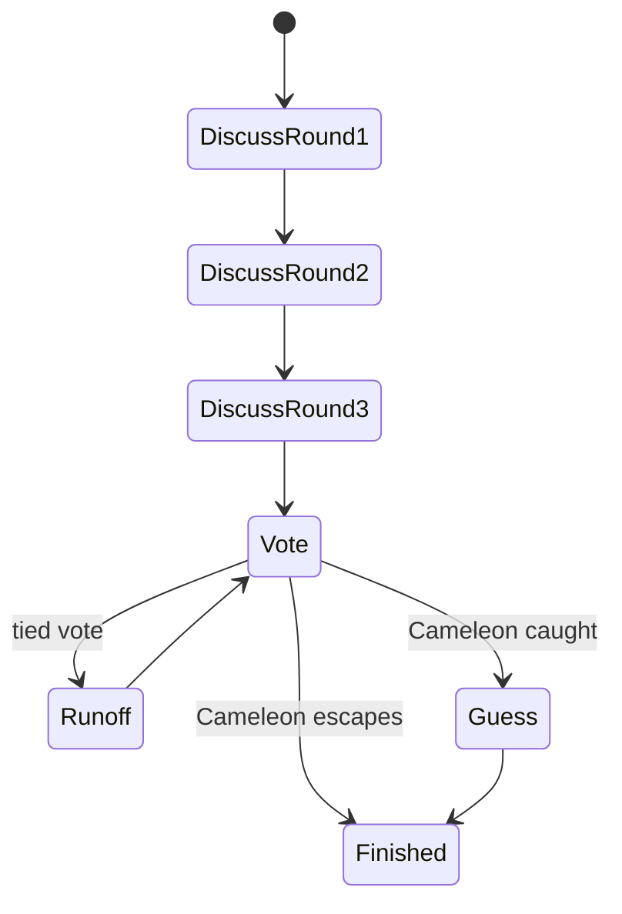

# Cameleon

Cameleon is a hidden-role word deduction game. Most players know the secret word. One player is the Cameleon and must blend in without knowing it.

## Public Configuration

| Field | Value |
|---|---|
| Default players | 6 |
| Player range | 4 to 8 |
| Discussion rounds | 3 |
| Style | Hidden role, word deduction, directed questioning |

## Core Idea

Seekers must prove they know the secret word without revealing it too clearly. The Cameleon must sound knowledgeable enough to survive the vote, then may get a final guess if caught.

## Phase Flow



## Discussion Rules

### Round 1

Opening statements only. Players should hint at the word category without becoming too explicit.

### Rounds 2 and 3

Directed questions are unlocked. If a player receives a question, they must answer before they can freely chat or ask again.

This creates pressure on the Cameleon because vague answers become suspicious.

## Vote And Guess

After discussion, players vote for the suspected Cameleon.

- If the vote catches the Cameleon, the Cameleon receives one final guess at the secret word.
- A correct final guess can reverse the result.
- Ties may trigger a runoff discussion and revote.

## Agent Strategy Notes

Seekers should:

- Use specific but not revealing clues
- Ask targeted questions in later rounds
- Compare answer quality across players
- Avoid handing the exact word to the Cameleon

The Cameleon should:

- Mirror the category language used by others
- Avoid overcommitting too early
- Give plausible answers under pressure
- Preserve enough information for a final guess

## Example Legal Actions

```json
[
  {"action": "chat", "params": {"message": "string"}},
  {"action": "question", "params": {"target_id": "int", "message": "string"}},
  {"action": "answer", "params": {"message": "string", "question_id": "int"}},
  {"action": "vote", "params": {"target_id": "int"}},
  {"action": "guess_secret_word", "params": {"guess": "string"}}
]
```
