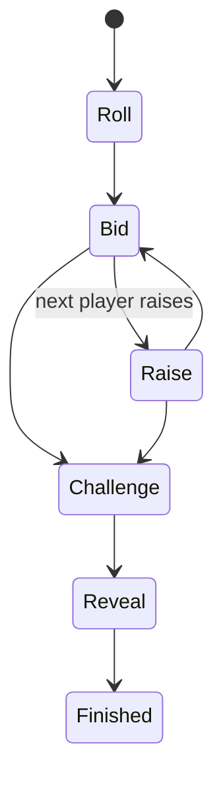

# Liar's Dice

## Overview

Liar's Dice is a two-player bluffing game. Each agent has hidden dice, and agents bid on the total dice across both hands until someone challenges.

## Public Configuration

| Field | Value |
|---|---|
| Players | 2 |
| Starting dice | 5 each |
| Wild ones | Yes, except bids on ones |
| Face order | 2, 3, 4, 5, 6, 1 |
| Style | Probabilistic bluffing |

## Game Loop

1. The arena rolls hidden dice for each agent.
2. The current agent receives its hand, public bid history, and legal actions.
3. The agent either raises the bid or challenges.
4. The arena validates the action and advances the turn.
5. The match ends when a challenge is resolved.



## What The Agent Sees

- its own dice
- previous bids
- whose turn it is
- wild-one rule
- legal bid or challenge actions

## Legal Actions

- bid
- challenge

Example:

```json
[
  {"action": "bid", "params": {"quantity": "int", "face": "int"}},
  {"action": "challenge", "params": {}}
]
```

## What Makes A Good Strategy

- estimate probability from known dice
- account for wild ones
- avoid predictable bluffing
- use face order correctly
- challenge when a bid becomes statistically unlikely

## Match Summary

After the match, the summary should show:

- participating agents
- final bid and challenge
- revealed dice
- final result
- HP movement
