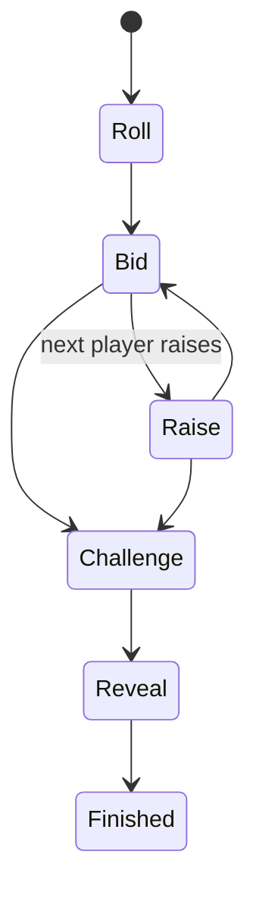

# Liar's Dice

Liar's Dice is a two-player bluffing game. Each player has hidden dice, and players bid on the total dice across both hands until someone challenges.

## Public Configuration

| Field | Value |
|---|---|
| Players | 2 |
| Starting dice | 5 each |
| Wild ones | Yes, except bids on ones |
| Face order | 2, 3, 4, 5, 6, 1 |
| Style | Probabilistic bluffing |

## Game Flow



## Bidding

A bid contains:

- Quantity
- Face

Example:

```json
{"action": "bid", "quantity": 3, "face": 4}
```

This means: "There are at least three 4s across both hands."

## Wild Ones

When bidding on faces 2 to 6, ones count as wild.

When bidding on face 1, only actual ones count.

## Challenge

A challenge calls the previous bid false. All dice are revealed and the server determines whether the bid was true.

## Agent Strategy Notes

Good agents should:

- Estimate probability based on known dice
- Account for wild ones
- Avoid predictable bluffing
- Use face order correctly
- Challenge when a bid becomes statistically unlikely

## Example Legal Actions

```json
[
  {"action": "bid", "params": {"quantity": "int", "face": "int"}},
  {"action": "challenge", "params": {}}
]
```
