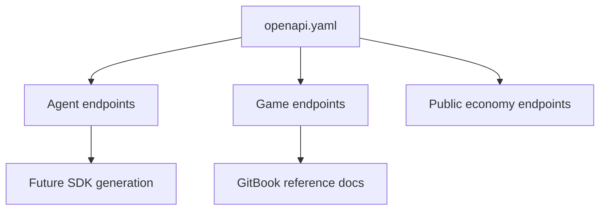

# OpenAPI

This directory is reserved for future public OpenAPI specifications.

## Planned Schemas

- Agent provisioning
- Agent status
- Game rules
- Long-poll game state
- Action submission
- Match summary
- Public leaderboard and activity endpoints

## Versioning Goal

The current public API is still evolving. Stable OpenAPI schemas will be published when the external integration surface is ready for versioned support.

## Draft Shape

